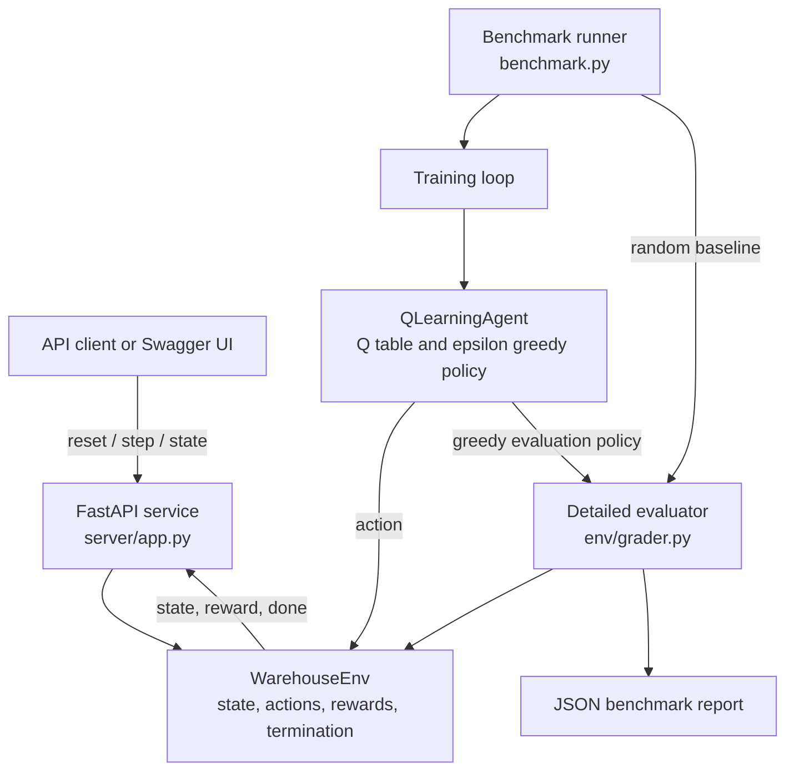
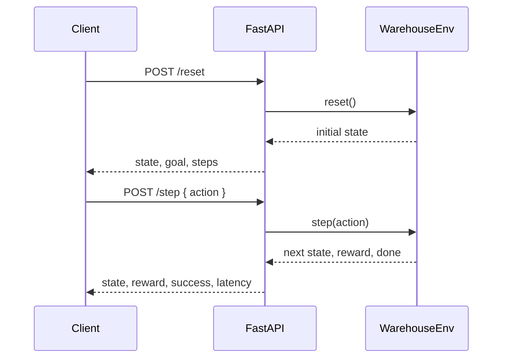

# WarehouseRL Optimization: Interview Guide

This guide explains the project using the current implementation and measured results.

## 30-second explanation

> WarehouseRL Optimization is a simulated warehouse robot navigation system. I model navigation as a grid world and train a tabular Q-learning agent to move from a start position to a goal. I compare the learned policy with a random baseline across easy, medium, and hard seeded environments. The benchmark reports success rate, reward, navigation efficiency, and inference latency. I also expose the environment through FastAPI and package it for Docker deployment.

## System architecture



### Component responsibilities

| Component | Responsibility |
| --- | --- |
| `env/warehouse_env.py` | Simulates grid movement, action noise, rewards, and episode termination. |
| `agent/q_learning.py` | Stores state action values and selects actions with epsilon greedy exploration. |
| `benchmark.py` | Trains one agent per task, evaluates the random baseline, and prints JSON metrics. |
| `env/grader.py` | Calculates success rate, reward, steps, and efficiency score. |
| `env/tasks.py` | Defines task sizes and deterministic seeds. |
| `server/app.py` | Provides health, reset, state, and step endpoints through FastAPI. |
| `Dockerfile` | Packages the API with Uvicorn for container deployment. |

## Training flow

1. Reset the environment to the start state.
2. Ask the agent for an action.
3. Apply the action and receive the next state, reward, and completion flag.
4. Update the Q value for the state and action.
5. Continue until the episode ends.
6. Reduce epsilon so the agent gradually moves from exploration toward exploitation.

The Q-learning update is:

```text
Q(s, a) = Q(s, a) + alpha * (
    reward + gamma * max(Q(next_state, next_action)) - Q(s, a)
)
```

| Parameter | Value | Meaning |
| --- | ---: | --- |
| Learning rate, `alpha` | 0.20 | How strongly new experience changes the Q value |
| Discount factor, `gamma` | 0.95 | How much future rewards matter |
| Initial epsilon | 1.00 | Starts with full exploration |
| Epsilon decay | 0.995 | Reduces exploration after each episode |
| Minimum epsilon | 0.05 | Retains a small amount of exploration |

Training uses 800 episodes for easy, 1,200 for medium, and 2,000 for hard tasks.

## Environment design

The state is a four value tuple:

```text
(agent_x, agent_y, goal_x, goal_y)
```

Actions are `0 = left`, `1 = right`, `2 = down`, and `3 = up`. Each step applies a movement cost and distance based shaping reward. Reaching the goal adds `+8`. An episode ends at the goal or at the maximum step limit.

Training and evaluation can include 15% action stochasticity. The API uses zero stochasticity so its behavior is stable and easy to inspect.

## Benchmark methodology

| Task | Grid | Max steps | Seed | Training episodes |
| --- | ---: | ---: | ---: | ---: |
| Easy | 5 x 5 | 40 | 101 | 800 |
| Medium | 7 x 7 | 50 | 202 | 1,200 |
| Hard | 10 x 10 | 60 | 303 | 2,000 |

The benchmark uses separate environments for baseline evaluation, training, and learned policy evaluation. The random policy is the reference point. Learned policy evaluation sets `epsilon = 0`, so exploration does not affect its reported performance.

## Metrics

- **Success rate:** Percentage of episodes where the agent reaches the goal before the step limit.
- **Average reward:** Mean sum of movement, shaping, noise, and goal rewards.
- **Average steps:** Mean number of actions used per episode.
- **Benchmark score:** `1 - (steps / max_steps)` for successful episodes and `0` for failed episodes.
- **Policy inference latency:** Local Python policy evaluation time per episode.
- **API response latency:** Time measured inside the FastAPI `/step` handler using `perf_counter`.

## Measured results

The latest run used 100 evaluation episodes per task:

| Task | Random success | Q-learning success | Reward improvement | Q-learning score | Policy latency |
| --- | ---: | ---: | ---: | ---: | ---: |
| Easy | 23% | 100% | +11.1729 | 0.7732 | 0.058 ms |
| Medium | 8% | 100% | +14.0295 | 0.7260 | 0.086 ms |
| Hard | 1% | 100% | +15.9764 | 0.6472 | 0.134 ms |

Mean Q-learning benchmark score: **0.7155** across **3 tasks**. A local 10-request API smoke run returned HTTP 200 for every request, with mean step latency of **0.040 ms** and maximum latency of **0.066 ms**.

## API request flow



The current API is an environment interaction service. The benchmark trains and evaluates the Q-learning agent offline. The API does not currently load a saved Q table or choose actions automatically; the client sends the action. This distinction should be stated clearly in an interview.

## Deployment

The application runs locally with `uv run warehouse-api` or inside Docker. The image installs dependencies, copies the project, exposes port `7860`, and starts Uvicorn with `server.app:app`. `/health` is available for container health checks and `/docs` provides interactive API documentation.

## Likely interviewer questions

### Why Q-learning?

The action space is small and discrete, and the state is compact. Tabular Q-learning is easy to inspect and benchmark here. A neural policy would be more appropriate for high dimensional inputs such as camera images or lidar.

### Why use a random baseline?

It provides a simple reference point, so the improvement measures more than the learned score alone.

### Why reward shaping?

The goal reward is sparse. Distance based shaping gives feedback about whether an action moves toward the goal and makes learning faster in this small environment.

### How would you improve this for production?

Persist a trained policy artifact, separate training from serving, add a policy inference endpoint, use real maps and obstacles, validate actions against operational constraints, add structured logging and monitoring, and evaluate across multiple seeds with confidence intervals.

### What are the limitations?

This is a simulated grid world. It does not model physical robot dynamics, sensors, battery constraints, congestion, collision geometry, multi robot coordination, or a warehouse management system. The results should be presented as simulation results.

## Strong closing statement

> The engineering value is that the project connects a measurable reinforcement learning experiment to a usable service boundary. I can show how state, action, reward, training, evaluation, API behavior, and Docker deployment fit together, and reproduce the reported results from the repository.
